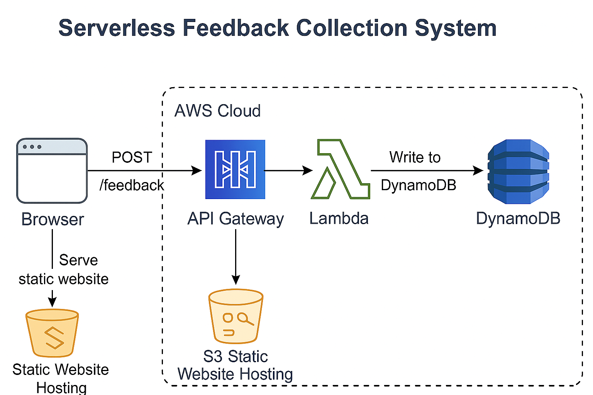
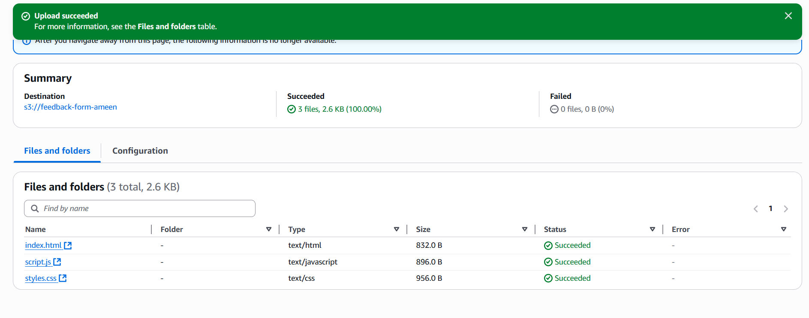
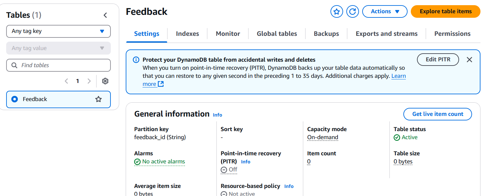
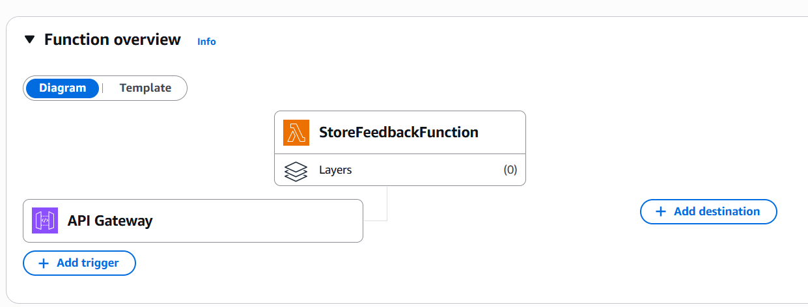
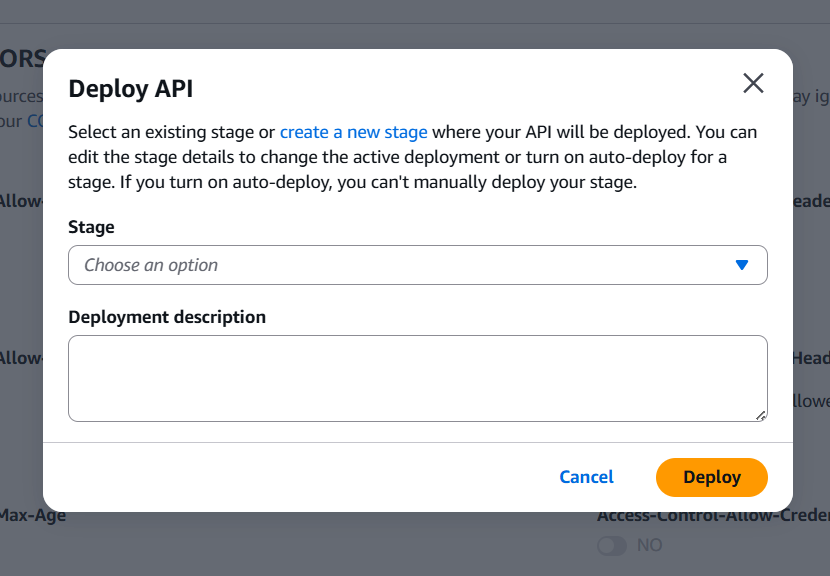
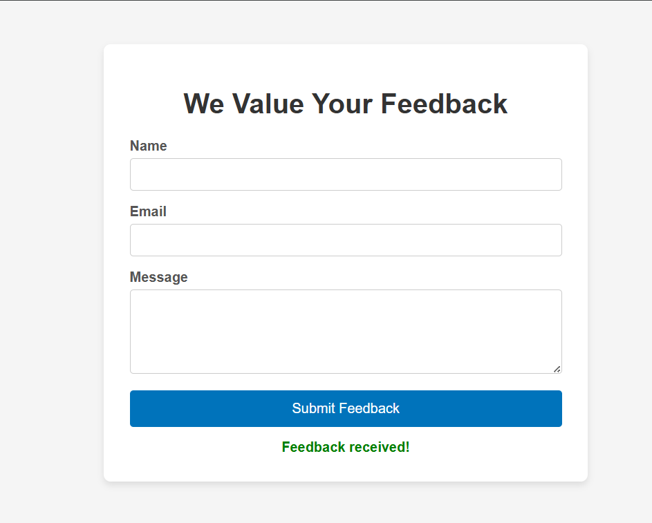

# Serverless Feedback Collection System

A fully serverless feedback collection platform designed for small businesses.  
Built using **AWS Free Tier services**: S3 (for static hosting), API Gateway, Lambda (Python), and DynamoDB.  

👉 **No server management. Zero cost. Scales automatically.**

---

## 📌 Architecture

---

## 💡 Features

- Static feedback form hosted on Amazon S3  
- API Gateway accepts POST requests securely  
- Lambda function processes submissions  
- Feedback stored in DynamoDB  
- Serverless design, no infrastructure to maintain  
- Free Tier eligible  

---

## ⚙️ Step-by-Step Setup

### 1️⃣ Prepare static site

- Create `index.html`, `script.js`, and optional `styles.css`  
- Upload files to S3  
- Enable static website hosting  
- Make objects public (adjust bucket policy / unblock public access)  

**📸 Screenshot:**  

---

### 2️⃣ Set up DynamoDB

- Create table `Feedback`  
- Use `feedbackId` as primary key (string type)  
- Leave TTL, streams, etc. disabled  

**📸 Screenshot:**  

---

### 3️⃣ Create Lambda function

- Runtime: Python 3.12  
- Uses boto3 to write feedback to DynamoDB  
- Attach policy: `dynamodb:PutItem` for your table  

**📸 Screenshot:**  

---

### 4️⃣ API Gateway

- Create HTTP API  
- Add `POST /feedback` route  
- Integrate with Lambda  
- Enable CORS (allow POST, content-type header, * origin)  
- Deploy stage (`prod` or `$default`)  

**📸 Screenshot:**  

---

### 5️⃣ Connect front-end

- `script.js` sends POST to your API URL  
- Test submission  

**📸 Screenshot:**  

---

## 🚧 Challenges & Solutions

| Challenge                    | Solution                                                   |
|------------------------------|------------------------------------------------------------|
| CORS error                    | Configured API Gateway CORS properly                        |
| Lambda `AccessDeniedException`| Updated Lambda role policy to allow `dynamodb:PutItem`      |
| S3 403 Forbidden              | Fixed bucket policy, unblocked public access                |
| API stage deployment issue    | Manually created stage + deployed routes                    |

---

## 📂 Repo Structure
/
├── index.html
├── script.js
├── styles.css
├── lambda_function.py
├── assets/
│ ├── architecture-diagram.png
│ ├── s3-setup-screenshot.png
│ ├── dynamodb-screenshot.png
│ ├── lambda-screenshot.png
│ ├── apigateway-screenshot.png
│ ├── form-submission-screenshot.png
├── README.md

yaml
Copy
Edit

---

## 🧠 What I Learned

- Working hands-on with serverless components: Lambda, API Gateway, and S3  
- Practical IAM role debugging and policy setup  
- Real-world application of CORS, deployments, and static hosting  
- Designing scalable, zero-cost AWS solutions from scratch

---

## 🤝 Let's Connect

Want to collaborate or hire? I'm open to cloud projects, internships, and roles.  
📩 [Muhammedmunabau@email.com] — 🔗 [linkedin.com/in/ameen123] — 🧠 #AWS #Serverless #CloudEngineering

---

